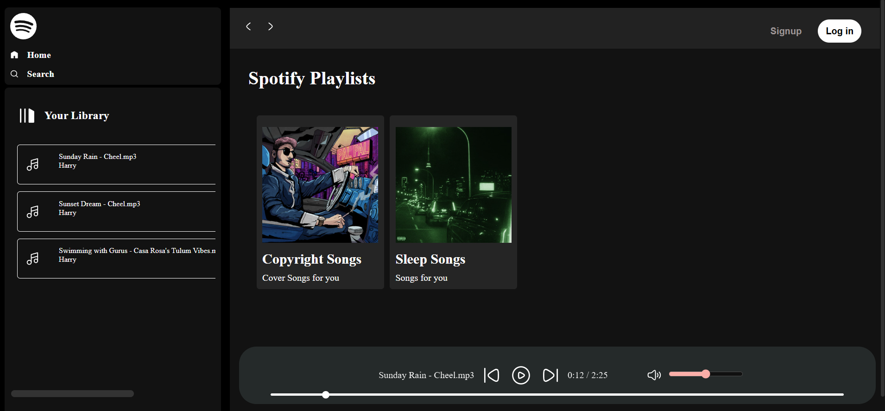

# 🎧 Spotify Clone

A frontend clone of Spotify built using HTML, CSS, and JavaScript. This project replicates Spotify’s UI and basic functionalities like navigation, play/pause, and song list rendering.

## 🛠 Features

- ✅ Responsive Spotify-like layout
- ✅ Custom music player controls
- ✅ Playlist and album view
---

## 🧱 Tech Stack

- HTML
- CSS
- JavaScript

---

## 🚀 Getting Started

### 📦 Clone the Repo
